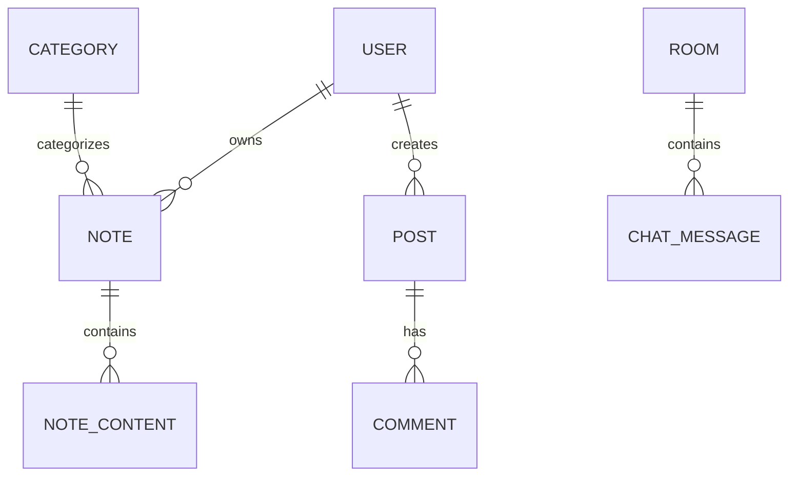
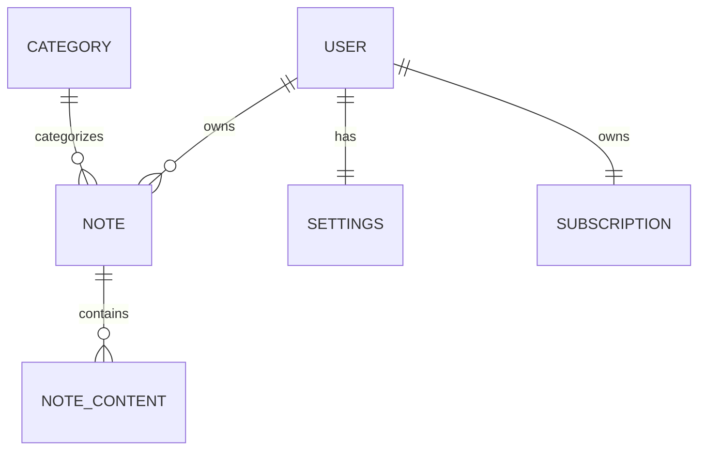
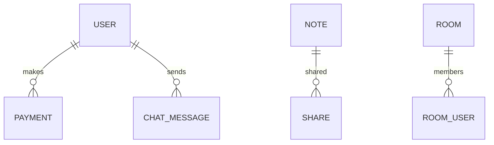
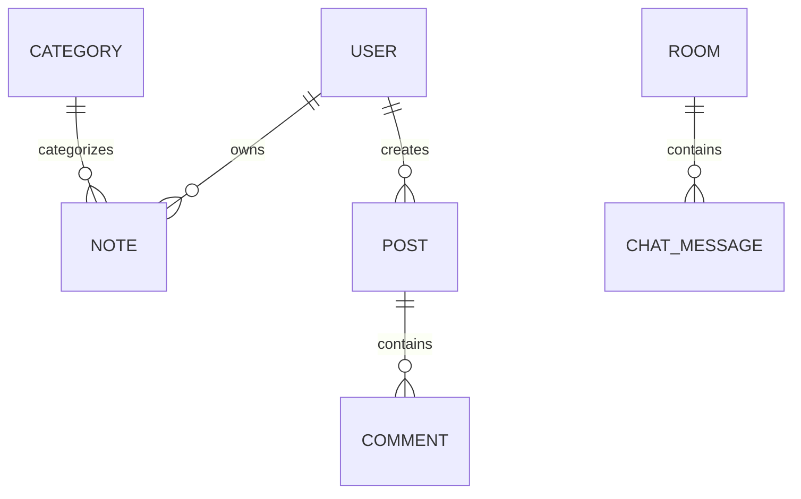

# Pustakam Database Architecture (database.md)

## Overview
Pustakam uses an offline-first architecture with SQLDelight locally and MongoDB as the cloud database.

## Features
- Notes
- OCR
- STT
- TTS
- AI
- Images
- Audio
- Video
- PDFs
- Chat
- Payments
- Subscription
- Sharing
- Categories

## 1NF



## 2NF



## 3NF



## MongoDB Collections

- users
- notes
- categories
- posts
- comments
- rooms
- messages
- payments
- subscriptions
- notifications
- ai_jobs
- sync_queue

## users
```json
{
 "_id":"",
 "profile":{},
 "settings":{},
 "subscription":{}
}
```

## notes
```json
{
 "_id":"",
 "ownerId":"",
 "title":"",
 "categoryId":"",
 "contents":[],
 "media":[],
 "tags":[],
 "share":[],
 "version":1,
 "syncStatus":"PENDING"
}
```

## Relationships



## Embedding vs Referencing

|Entity|Strategy|
|---|---|
|Settings|Embed|
|Subscription|Embed|
|Note Content|Embed|
|Messages|Reference|
|Payments|Reference|

## Indexes

notes:
- ownerId
- categoryId
- updatedAt
- createdAt
- syncStatus
- title(text)

messages:
- roomId
- senderId
- createdAt

## Offline Sync

Device -> SQLDelight -> Sync Queue -> API -> MongoDB

## Versioning

- version
- createdAt
- updatedAt
- deleted
- syncStatus

## Security

- JWT
- RBAC
- HTTPS
- Encryption

## Scaling

- Replica Sets
- Sharding
- CDN
- Object Storage

## Best Practices

- UUID IDs
- Soft delete
- Optimistic locking
- Keep documents under 16MB
- Embed tightly coupled data
- Reference high-growth entities
