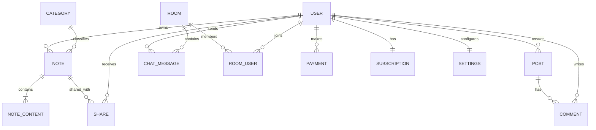
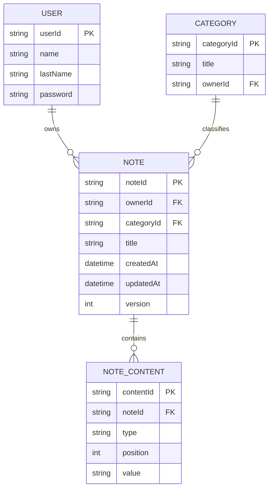
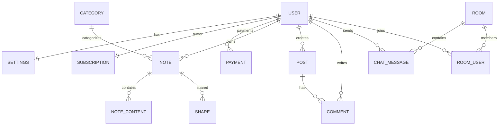

# Pustakam Database Design (MongoDB)

> Based on the uploaded ERD. Although MongoDB is document-oriented and does not require normalization, the following progression shows how the logical model evolves from 1NF → 2NF → 3NF before mapping to MongoDB collections.

Source: Uploaded ERD fileciteturn0file0

---

# 1NF



---

# 2NF

Remove repeating and partially dependent attributes.



---

# 3NF

Separate independent entities.



---

# MongoDB Collection Design

```text
users
 ├── settings (embedded)
 ├── subscription (embedded)
 └── paymentIds (optional references)

notes
 ├── categoryId
 ├── content[]     (embedded)
 ├── share[]
 └── version

categories

posts
 ├── comments[] (or separate collection if very large)

rooms
 ├── participants[]
 └── lastMessage

messages

payments
```

## MongoDB Design Notes

- Embed `note.content[]` because it belongs only to a single note.
- Embed `settings` and `subscription` inside `users`.
- Keep `messages` in a separate collection for scalability.
- Keep `payments` separate because they grow independently.
- `shares` may be embedded inside notes unless access lists become very large.
